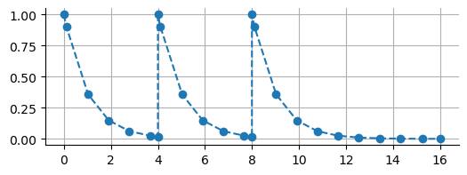

# scipy_events

[![Copier Badge][copier-badge]][copier-url]
[![Pixi Badge][pixi-badge]][pixi-url]
![License][license-badge]
[![CI Badge][ci-badge]][ci-url]
[![conda-forge Badge][conda-forge-badge]][conda-forge-url]
[![PyPI Badge][pypi-badge]][pypi-url]
[![Python version Badge][pypi-version-badge]][pypi-version-url]

A library of events for `scipy.integrate.solve_ivp`.

It provides the following events:

- `ChangeWhen` to apply a change when a given event happens.
- `ChangeAt` to apply a change at some given times.

## Usage

```python
import numpy as np
from scipy_events import ChangeAt, solve_ivp

result = solve_ivp(
    lambda t, y: -y,
    t_span=(0, 16),
    y0=[1],
    events=[
        ChangeAt(
            times=[4, 8],
            change=lambda t, y, args: (np.full_like(y, 1), args),
        )
    ],
)
```



```python
import numpy as np
from scipy_events import ChangeWhen, solve_ivp

result = solve_ivp(
    lambda t, y: -y,
    t_span=(0, 16),
    y0=[1],
    events=[
        ChangeWhen(
            condition=lambda t, y: y[0] - 1e-2,
            change=lambda t, y, args: (np.full_like(y, 1), args),
        )
    ],
)
```


## Install

Using [pixi][pixi-url],
install from PyPI with:

```sh
pixi add --pypi scipy-events
```

or install the latest development version from GitHub with:

```sh
pixi add --pypi scipy-events@https://github.com/dyscolab/scipy-events.git
```

Otherwise,
use `pip` or your `pip`-compatible package manager:

```sh
pip install scipy-events  # from PyPI
pip install git+https://github.com/dyscolab/scipy-events.git  # from GitHub
```

## Development

This project is managed by [pixi][pixi-url].
You can install it for development using:

```sh
git clone https://github.com/dyscolab/scipy-events
cd scipy-events
pixi run pre-commit-install
```

Pre-commit hooks are used to lint and format the project.

### Testing

Run tests using:

```sh
pixi run test
```

### Publishing to PyPI

When a tagged commit is pushed to GitHub,
the GitHub Action defined in `.github/workflows/ci.yml`
builds and publishes the package to PyPI.

Tag a commit and push the tags with:

```sh
git tag <my-tag>
git push --tags
```

Trusted publishing must be enabled once in [PyPI Publishing](https://pypi.org/manage/account/publishing/).
Fill the following values in the form:

```
PyPI Project Name: scipy-events
            Owner: maurosilber
  Repository name: scipy-events
    Workflow name: ci.yml
 Environment name: pypi
```

[ci-badge]: https://img.shields.io/github/actions/workflow/status/dyscolab/scipy-events/ci.yml
[ci-url]: https://github.com/dyscolab/scipy-events/actions/workflows/ci.yml
[conda-forge-badge]: https://img.shields.io/conda/vn/conda-forge/scipy-events?logoColor=white&logo=conda-forge
[conda-forge-url]: https://prefix.dev/channels/conda-forge/packages/scipy-events
[copier-badge]: https://img.shields.io/endpoint?url=https://raw.githubusercontent.com/copier-org/copier/master/img/badge/badge-black.json
[copier-url]: https://github.com/copier-org/copier
[license-badge]: https://img.shields.io/badge/license-MIT-blue
[pixi-badge]: https://img.shields.io/endpoint?url=https://raw.githubusercontent.com/prefix-dev/pixi/main/assets/badge/v0.json
[pixi-url]: https://pixi.sh
[pypi-badge]: https://img.shields.io/pypi/v/scipy-events.svg?logo=pypi&logoColor=white
[pypi-url]: https://pypi.org/project/scipy-events
[pypi-version-badge]: https://img.shields.io/pypi/pyversions/scipy-events?logoColor=white&logo=python
[pypi-version-url]: https://pypi.org/project/scipy-events
